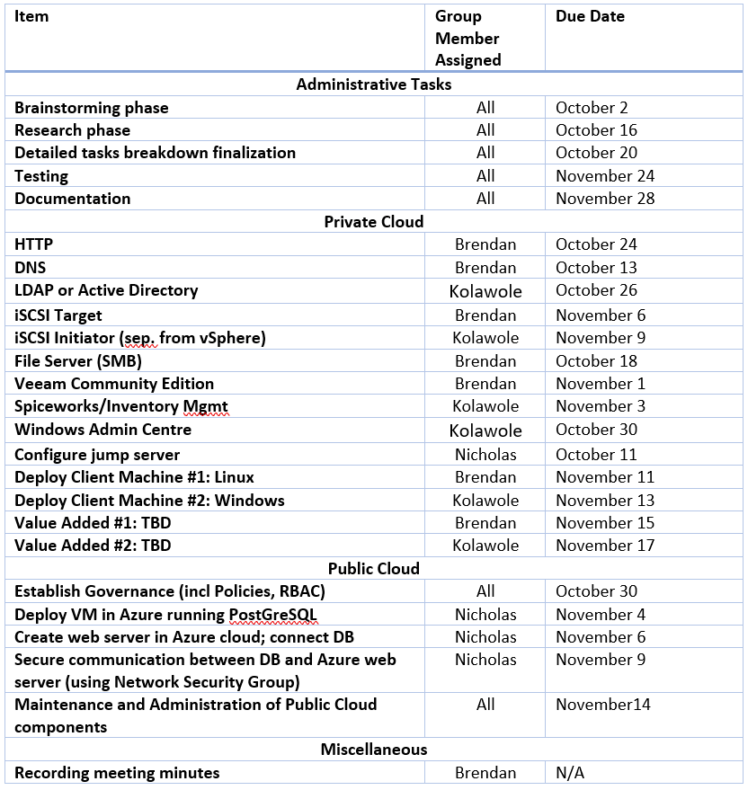
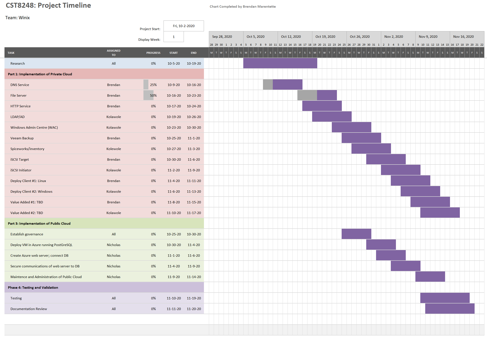

# Assignment 1
## Project Initialization, Planning and Communication
### Completed for CST8248 by Team Winix

#### Team members;
Brendan Marentette

Kolawole Adamo

Nicholas Hancin

#### Project Timeline
Start Date: September 25th, 2020

End Date: December 11, 2020

#### Task Assignment Table

#### Gantt Chart

#### Communications Plan
  - Meetings will occur on a regular basis in order to monitor the progress of the upcoming deliverables for the project. 
  - Meetings will occur weekly, with the possibility of additional meetings as needed. 
  - The meetings will occur every Thursday at 11AM. The minutes will usually be recorded by Brendan; 
      - however, this may vary from meeting to meeting. 
  - The minutes will be stored in a shared Microsoft OneDrive folder that is accessible for all group members taking part in the assignment.
